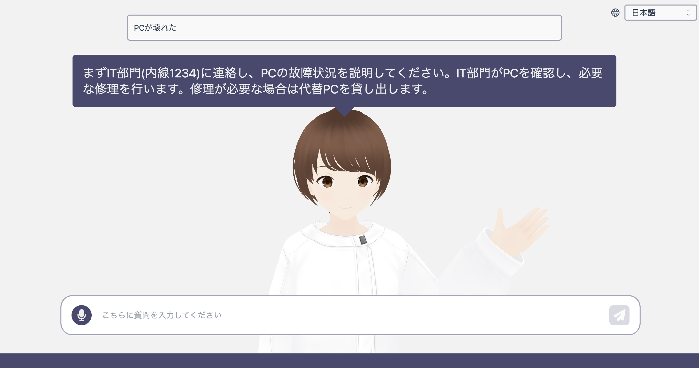

# RAG Avatar Demo

[README in English](README_en.md)



3Dアバターをインタフェースとして持つ、Generative AI チャットボットのサンプル実装です。


## アーキテクチャ


## デプロイ

このアプリケーションは [AWS Cloud Development Kit](https://aws.amazon.com/jp/cdk/)（以降 CDK）を利用してデプロイします。

### 事前準備

#### Credential の設定

CDK を実行するためには、 AWS の Credential を設定する必要があるので、以下の手順で実施してください。

* ローカル PC でデプロイする場合
  * [こちらの前提条件](https://docs.aws.amazon.com/ja_jp/cdk/v2/guide/getting_started.html#getting_started_prerequisites)を参考にセットアップを行ってください。
* それ以外の場合
  * [AWS Cloud9](https://aws.amazon.com/jp/cloud9/) を利用したデプロイがオススメです。
  * [こちら](https://github.com/aws-samples/cloud9-setup-for-prototyping)を利用すると、簡単に Cloud9 の環境を立ち上げることができます。

#### Amazon Bedrock で利用する基盤モデルの設定

> [!IMPORTANT]
> 本リポジトリで利用する Anthropic Claude モデルの利用は事前申請が必要です。 [Model access 画面 (ap-northeast-1)](https://ap-northeast-1.console.aws.amazon.com/bedrock/home?region=ap-northeast-1#/modelaccess)を開き、Anthropic Claude Instant にチェックして Save changes してください。利用するリージョンとモデル単位で申請が必要なので、ご注意ください。

デフォルトでは、東京リージョン（`ap-northeast-1`）の `Claude Instant` モデルを利用する設定になっています。もし、利用するリージョンとモデルを変更したい場合は、`packages/cdk/cdk.json` の `bedrock-region` と `bedrock-model-id` を変更してください。

**こちらのリポジトリは、`anthropic.claude-instant-v1`、`anthropic.claude-v2`、`anthropic.claude-v2:1` のみ対応しています。他のモデルは利用できませんので、ご注意ください。**

### デプロイ手順

1. 本リポジトリを clone してください。
1. clone した本リポジトリの**ルートディレクトリ**をターミナルで開いてください。以降のコマンドは、すべて**ルートディレクトリ**で実行します。
1. 以下のコマンドで必要なパッケージをインストールします。  

    ```bash
    npm ci
    ```

1. CDK を利用したことがない場合、初回のみ [Bootstrap](https://docs.aws.amazon.com/ja_jp/cdk/v2/guide/bootstrapping.html) 作業が必要です。すでに Bootstrap された環境では以下のコマンドは不要です。

    ```bash
    npx -w packages/cdk cdk bootstrap
    ```

1. 以下のコマンドで AWS リソースをデプロイします。デプロイが完了するまで、お待ちください（20 分程度かかる場合があります）。

    ```bash
    npm run cdk:deploy
    ```

1. デプロイが完了すると、以下のようにデプロイ情報が Outputs として表示されます (`packages/cdk/output.json` にも同様の情報が出力されています )。`ragAvatarStack.FrontendCloudFrontURL` がデプロイされた URL です。こちらにアクセスしてご利用ください。

    ```bash
    Outputs:
    RagAvatarStack.ApiIdPoolIdxxxxxxxx = us-west-2:xxxxxxxxxxxxxxxxxxxxxxxxxx
    RagAvatarStack.ApiQuestionStreamFunctionARNxxxxxxxx = arn:aws:lambda:us-west-2:123456789012:function:RagAvatarStack-ApiStreamQuestionxxxxxxxxxx-xxxxxxxxxxxx
    RagAvatarStack.FrontendCloudFrontURLxxxxxxxx = https://xxxxxxxxxxxxxxxxxxxxxxxxxx.cloudfront.net
    RagAvatarStack.S3DataSourceKendraIndexIdxxxxxxxx = xxxxxxxxxxxxxxxxxxxxxxxxxxxxxxxxxx
    RagAvatarStack.S3DataSourceKendraS3DataSourceIdxxxxxxxx = xxxxxxxxxxxxxxxxxxxxxxxxxxxxxxxxxx
    ```

### 再デプロイ手順

アプリケーションを最新化する場合は、再デプロイが必要です。以下のコマンドを実行すると、差分デプロイが自動で行われます。

```bash
npm run cdk:deploy
```

### ドキュメントの反映手順

ドキュメントは、Amazon Kendra（以降、Kendra）を利用して検索しています。本アプリケーションにドキュメントを反映するためには、Kendra で `Sync` を行う必要がありますので、以下の手順で `Sync` してください。

1. [Kendra コンソール](https://ap-northeast-1.console.aws.amazon.com/kendra/home?region=ap-northeast-1#indexes) にアクセスし、`rag-avatar-index` を開いてください。
2. 「Data sources」のページを開き、`s3-data-source` を開いてください。
3. 「Sync now」ボタンを押して、ドキュメントを反映してください。「Last sync status」が `Successful` と表示されていれば、ドキュメントを検索できます。

#### ドキュメントを更新したい場合

1. `packages/cdk/docs` にドキュメントを格納してください。
2. 「再デプロイ手順」通りに、アプリケーションを再デプロイしてください（自動でドキュメントもアップロードされます）。
3. 上記のドキュメント反映手順通りに、`Sync` を行ってください。

### クリーンアップ手順

1. 以下のコマンドを実行してください。デプロイしたすべての AWS リソースが削除されます。

    ```bash
    npm run cdk:destroy
    ```

上記のコマンド実行時にエラーが発生した場合は、以下の手順に沿って手動で Stack を削除してください。

1. [AWS CloudFormation](https://console.aws.amazon.com/cloudformation/home) を開き、 `RagAvatarStack` を選択。
1. Delete を押下。この際に削除に失敗した S3 Bucket の削除をスキップするか聞かれるため、チェックを入れて削除を実行。
1. 削除をスキップした S3 Bucket を除いたリソースの削除が完了する。
1. [Amazon S3](https://s3.console.aws.amazon.com/s3/home) を開き、スキップした S3 Bucket を探す。("RagAvatar" 等で検索してください。)
1. Empty ( Bucket を空にする ) => Delete ( Bucket を削除する ) を実行

### フロントエンドのローカル実行

フロントエンドは、以下の手順でローカル PC で実行できます。フロントエンドの修正結果をすぐにブラウザで確認できるため、開発効率を大幅に上げることができます。  
こちらのコマンドはすべて、本リポジトリの**ルートディレクトリ**で実行してください。

なお、この手順は、ローカル PC で React が開発できる状態になっていることを前提としています。  

1. `packages/web/.env` をコピーして `packages/web/.env.local` ファイル作成してください。

    ```bash
    VITE_APP_REGION=デプロイしたリージョン名
    VITE_APP_IDENTITY_POOL_ID=Outputs の RagAvatarStack.ApiIdPoolId の値
    VITE_APP_QUESTION_STREAM_FUNCTION_ARN=Outputs の RagAvatarStack.ApiQuestionStreamFunctionARN の値
    ```

    **Outputs の確認方法**
    * ご利用の PC からデプロイを実行した場合
      * `packages/cdk/output.json` に `Outputs` の値が出力されているので、そちらをご確認ください。
    * 上記以外の場合
      * [CloudFormation のコンソール](https://ap-northeast-1.console.aws.amazon.com/cloudformation/home) で `RagAvatarStack` を開いてください。
      * 「出力」タブを選択すると、`Outputs` の値が表示されるので、そちらをご確認してください。

1. 初回のみ以下のコマンドを実行して、パッケージをインストールしてください。

    ```bash
    npm ci 
    ```

1. 以下のコマンドを実行して、フロントエンドのローカルサーバを起動してください。

    ```bash
    npm run web:dev
    ```
