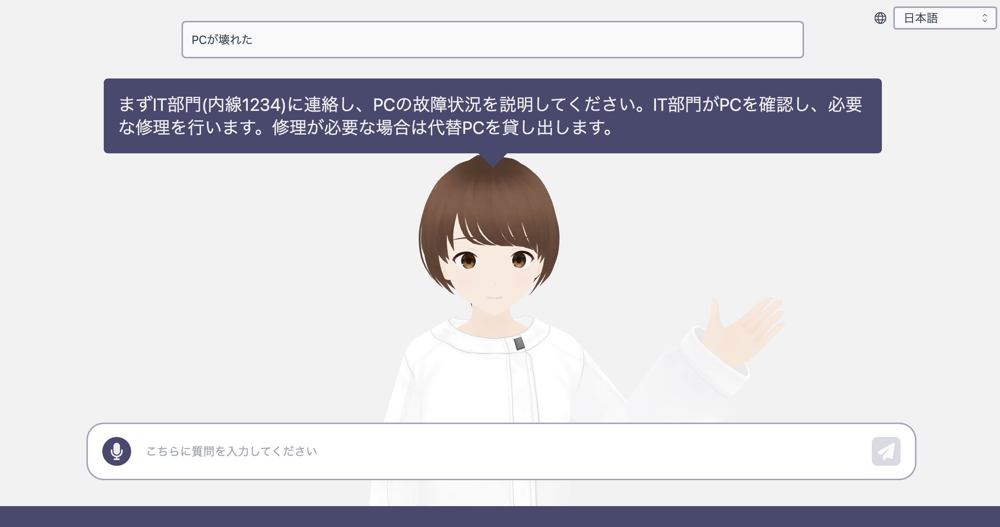
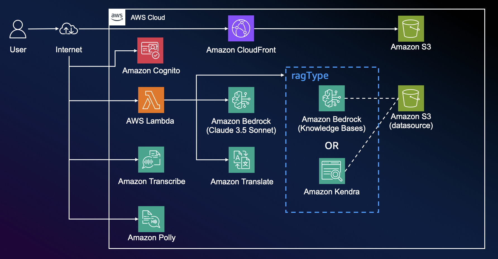

# Generative AI Avatar Chat

[README in English](README_en.md)



3Dアバターをインタフェースとして持つ、Generative AI チャットボットのサンプル実装です。


## アーキテクチャ



## デプロイ

このアプリケーションは [AWS Cloud Development Kit](https://aws.amazon.com/jp/cdk/)（以降 CDK）を利用してデプロイします。

### 事前準備

#### Credential の設定

CDK を実行するためには、 AWS の Credential を設定する必要があるので、以下の手順で実施してください。

* ローカル PC でデプロイする場合
  * [こちらの前提条件](https://docs.aws.amazon.com/ja_jp/cdk/v2/guide/getting_started.html#getting_started_prerequisites)を参考にセットアップを行ってください。
* それ以外の場合
  * [AWS Cloud9](https://aws.amazon.com/jp/cloud9/) を利用したデプロイがオススメです。
  * [こちら](https://github.com/aws-samples/cloud9-setup-for-prototyping)を利用すると、簡単に Cloud9 の環境を立ち上げることができます。

#### Amazon Bedrock で利用する基盤モデルの設定

> [!IMPORTANT]
> 本リポジトリで利用する Anthropic Claude モデルの利用は事前申請が必要です。 [Model access 画面 (ap-northeast-1)](https://ap-northeast-1.console.aws.amazon.com/bedrock/home?region=ap-northeast-1#/modelaccess)を開き、Anthropic Claude Haiku にチェックして Save changes してください。利用するリージョンとモデル単位で申請が必要なので、ご注意ください。

デフォルトでは、東京リージョン（`ap-northeast-1`）の日本Cross Region Inference経由で `Claude Haiku 4.5` モデルを利用する設定になっています。もし、利用するリージョンとモデルを変更したい場合は、`packages/cdk/lib/parameters.ts` の `base` オブジェクトの `bedrockRegion` と `bedrockModelId` を変更してください。モデルIDは[こちら](https://docs.aws.amazon.com/bedrock/latest/userguide/model-ids.html)をご参照ください。

**本アプリケーションは [Strands Agents SDK](https://github.com/aws-samples/strands-agents) を使用しており、Bedrock Converse API に対応しているモデルならばいずれも使用可能です。**

#### RAG タイプの設定

本アプリケーションでは、RAG（Retrieval-Augmented Generation）の実装として、以下のオプションを選択できます：

- **Knowledge Base**: Amazon Bedrock Knowledge Base を利用
- **Kendra**: Amazon Kendra を利用
- **両方**: 両方のRAGソースを同時に使用（Agentが適切に選択）
- **なし**: RAGなしで一般的な知識で回答

デフォルトでは `Knowledge Base` のみが有効になっています。設定を変更したい場合は、`packages/cdk/lib/parameters.ts` の `defaultParameters` オブジェクトまたは各環境の `envOverrides` を変更してください。

```typescript
// packages/cdk/lib/parameters.ts
const defaultParameters: AppParameters = {
  bedrockRegion: 'ap-northeast-1',
  bedrockModelId: 'jp.anthropic.claude-haiku-4-5-20251001-v1:0',
  rag: {
    kendra: { enabled: false },
    knowledgeBase: { enabled: true },
  },
  agentcore: {
    region: 'ap-northeast-1',
    runtimeArn: '',
  },
};

// 環境別の上書き（defaultParameters からの差分のみ記述）
const envOverrides: Record<string, Partial<AppParameters>> = {
  base: {},   // 前方互換（スタック名: RagAvatarStack）
  dev: {},
  stg: {},
  prod: {
    rag: {
      kendra: { enabled: true },
      knowledgeBase: { enabled: true },
    },
  },
};
```

#### 環境の切り替え

`ENV` 環境変数で環境を切り替えられます。スタック名は `RagAvatarStack-{ENV}` になります（未指定または `base` の場合は `RagAvatarStack`）。

```bash
# base 環境（デフォルト）
npm run cdk:deploy

# dev 環境
ENV=dev npm run cdk:deploy

# prod 環境
ENV=prod npm run cdk:deploy
```

> [!WARNING]
> **両方のRAGソースを有効化する場合の注意事項**
> 
> 両方を `true` に設定すると、Agentは両方のRAGソースからドキュメントを検索するため、レスポンス速度が遅くなる可能性があります。各RAGソースに格納するドキュメントの内容を明確に区別し、Agentが適切なツールを選択できるようにすることを推奨します。
> 
> **推奨される使い分け例:**
> - **Knowledge Base**: 製品マニュアル、技術仕様書など
> - **Kendra**: 社内FAQ、運用手順書など
> 
> 各RAGソースの役割を明確にし、適切にドキュメントを配置してください。

### デプロイ手順

> [!IMPORTANT]
> **Docker の ARM64 ビルドについて**
> 
> 本アプリケーションのデプロイでは、ARM64 アーキテクチャの Docker イメージをビルドします。x86_64 マシンで実行する場合は、Docker Buildx と QEMU による ARM64 エミュレーションのセットアップが必要です。
> 
> ```bash
> # QEMU の登録
> docker run --rm --privileged tonistiigi/binfmt:latest --install arm64
> 
> # Buildx ビルダーの作成・起動
> docker buildx create --name arm-builder --platform linux/arm64 --use
> docker buildx inspect arm-builder --bootstrap
> ```

1. 本リポジトリを clone してください。
1. clone した本リポジトリの**ルートディレクトリ**をターミナルで開いてください。以降のコマンドは、すべて**ルートディレクトリ**で実行します。
1. 以下のコマンドで必要なパッケージをインストールします。  

    ```bash
    npm ci
    ```

1. CDK を利用したことがない場合、初回のみ [Bootstrap](https://docs.aws.amazon.com/ja_jp/cdk/v2/guide/bootstrapping.html) 作業が必要です。すでに Bootstrap された環境では以下のコマンドは不要です。

    ```bash
    npx -w packages/cdk cdk bootstrap
    ```

1. 以下のコマンドで AWS リソースをデプロイします。デプロイが完了するまで、お待ちください（20 分程度かかる場合があります）。

    ```bash
    npm run cdk:deploy
    ```

1. デプロイが完了すると、以下のようにデプロイ情報が Outputs として表示されます (`packages/cdk/output.json` にも同様の情報が出力されています )。`ragAvatarStack.FrontendCloudFrontURL` がデプロイされた URL です。こちらにアクセスしてご利用ください。

    ```bash
    Outputs:
    RagAvatarStack.ApiIdPoolIdxxxxxxxx = us-west-2:xxxxxxxxxxxxxxxxxxxxxxxxxx
    RagAvatarStack.ApiQuestionStreamFunctionARNxxxxxxxx = arn:aws:lambda:us-west-2:123456789012:function:RagAvatarStack-ApiStreamQuestionxxxxxxxxxx-xxxxxxxxxxxx
    RagAvatarStack.FrontendCloudFrontURLxxxxxxxx = https://xxxxxxxxxxxxxxxxxxxxxxxxxx.cloudfront.net
    RagAvatarStack.S3DataSourceKendraIndexIdxxxxxxxx = xxxxxxxxxxxxxxxxxxxxxxxxxxxxxxxxxx
    RagAvatarStack.S3DataSourceKendraS3DataSourceIdxxxxxxxx = xxxxxxxxxxxxxxxxxxxxxxxxxxxxxxxxxx
    ```

### 再デプロイ手順

アプリケーションを最新化する場合は、再デプロイが必要です。以下のコマンドを実行すると、差分デプロイが自動で行われます。

```bash
npm run cdk:deploy
```

### ドキュメントの反映手順

ドキュメントの反映手順は、選択したRAGタイプによって異なります。

#### Knowledge Base

Amazon Bedrock Knowledge Base を利用している場合、以下の手順でドキュメントを反映してください。

1. [Bedrock Knowledge Base コンソール](https://ap-northeast-1.console.aws.amazon.com/bedrock/home?region=ap-northeast-1#/knowledge-bases) にアクセスし、`rag-avatar-kb` を開いてください。
2. 「データソース」の欄に記載のある `rag-avatar-kb-datasource` を選択してください。
3. 「同期（Sync）」ボタンを押してドキュメントを反映してください。
4. 同期履歴のステータスが「完了」と表示されていれば、ドキュメントを検索できます。

#### Kendra

Amazon Kendra を利用している場合、ドキュメントを反映するためには Kendra で `Sync` を行う必要があります。以下の手順で `Sync` してください。

1. [Kendra コンソール](https://ap-northeast-1.console.aws.amazon.com/kendra/home?region=ap-northeast-1#indexes) にアクセスし、`rag-avatar-index` を開いてください。
2. 「Data sources」のページを開き、`s3-data-source` を開いてください。
3. 「Sync now」ボタンを押して、ドキュメントを反映してください。「Last sync status」が `Successful` と表示されていれば、ドキュメントを検索できます。

#### ドキュメントを更新したい場合

1. ドキュメントを格納してください。
   - **Knowledge Base用**: `packages/cdk/docs/kb` に格納
   - **Kendra用**: `packages/cdk/docs/kendra` に格納
2. 「再デプロイ手順」通りに、アプリケーションを再デプロイしてください（自動でドキュメントもアップロードされます）。
3. **Knowledge Base の場合**: 上記のドキュメント反映手順通りに、`Sync` を行ってください。
4. **Kendra の場合**: 上記のドキュメント反映手順通りに、`Sync` を行ってください。

### クリーンアップ手順

1. 以下のコマンドを実行してください。デプロイしたすべての AWS リソースが削除されます。

    ```bash
    npm run cdk:destroy
    ```

上記のコマンド実行時にエラーが発生した場合は、以下の手順に沿って手動で Stack を削除してください。

1. [AWS CloudFormation](https://console.aws.amazon.com/cloudformation/home) を開き、 `RagAvatarStack` を選択。
1. Delete を押下。この際に削除に失敗した S3 Bucket の削除をスキップするか聞かれるため、チェックを入れて削除を実行。
1. 削除をスキップした S3 Bucket を除いたリソースの削除が完了する。
1. [Amazon S3](https://s3.console.aws.amazon.com/s3/home) を開き、スキップした S3 Bucket を探す。("RagAvatar" 等で検索してください。)
1. Empty ( Bucket を空にする ) => Delete ( Bucket を削除する ) を実行

### フロントエンドのローカル実行

フロントエンドは、以下の手順でローカル PC で実行できます。フロントエンドの修正結果をすぐにブラウザで確認できるため、開発効率を大幅に上げることができます。  
こちらのコマンドはすべて、本リポジトリの**ルートディレクトリ**で実行してください。

なお、この手順は、ローカル PC で React が開発できる状態になっていることを前提としています。  

1. `packages/web/.env` をコピーして `packages/web/.env.local` ファイル作成してください。

    ```bash
    VITE_APP_REGION=デプロイしたリージョン名
    VITE_APP_IDENTITY_POOL_ID=Outputs の RagAvatarStack.ApiIdPoolId の値
    VITE_APP_QUESTION_STREAM_FUNCTION_ARN=Outputs の RagAvatarStack.ApiQuestionStreamFunctionARN の値
    VITE_APP_PRESIGNED_URL_FUNCTION_ARN=Outputs の RagAvatarStack.PresignedUrlApiPresignedUrlFunctionARN の値（AgentCore Runtime 使用時のみ）
    ```

    **Outputs の確認方法**
    * ご利用の PC からデプロイを実行した場合
      * `packages/cdk/output.json` に `Outputs` の値が出力されているので、そちらをご確認ください。
    * 上記以外の場合
      * [CloudFormation のコンソール](https://ap-northeast-1.console.aws.amazon.com/cloudformation/home) で `RagAvatarStack` を開いてください。
      * 「出力」タブを選択すると、`Outputs` の値が表示されるので、そちらをご確認してください。

1. 初回のみ以下のコマンドを実行して、パッケージをインストールしてください。

    ```bash
    npm ci 
    ```

1. 以下のコマンドを実行して、フロントエンドのローカルサーバを起動してください。

    ```bash
    npm run web:dev
    ```

## Contributors

[Yusuke Wada](https://github.com/wadabee)

[Tatsuya Shimada](https://github.com/tatshima)

[Shota Nakamoto](https://github.com/nsxshotaws)
