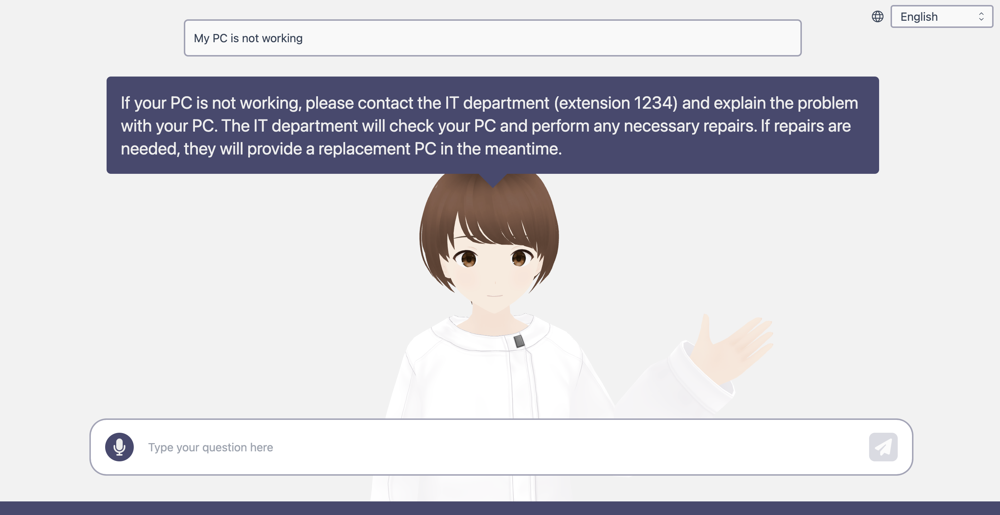
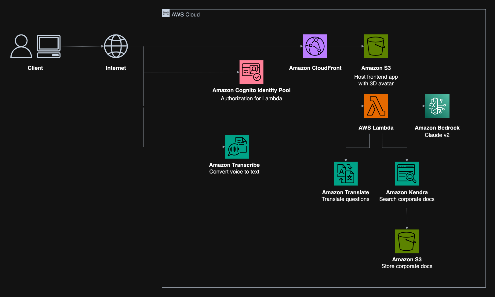

# Generative AI Avatar Chat

[README in Japanese](README.md)



This is a sample implementation of a Generative AI chatbot with a 3D avatar as the interface.

## Architecture



## Deployment

This application is deployed using the [AWS Cloud Development Kit](https://aws.amazon.com/jp/cdk/) (hereinafter referred to as CDK).

### Prerequisites

#### Setting up Credentials

To execute CDK, it is necessary to set up AWS credentials. Please follow the steps below.

* If deploying from a local PC
  * Please set up according to [these prerequisites](https://docs.aws.amazon.com/ja_jp/cdk/v2/guide/getting_started.html#getting_started_prerequisites).
* For other cases
  * It is recommended to deploy using [AWS Cloud9](https://aws.amazon.com/jp/cloud9/).
  * You can easily set up a Cloud9 environment using [this guide](https://github.com/aws-samples/cloud9-setup-for-prototyping).

#### Setting up the Base Model for Use with Amazon Bedrock

> [!IMPORTANT]
> Prior application is necessary to use the Anthropic Claude model in this repository. Open the [Model access screen (ap-northeast-1)](https://ap-northeast-1.console.aws.amazon.com/bedrock/home?region=ap-northeast-1#/modelaccess), check Anthropic Claude Instant and Save changes. Please note that application is required for each region and model you wish to use.

By default, the `Claude Instant` model in the Tokyo region (`ap-northeast-1`) is set for use. If you wish to change the region and model used, please modify `bedrock-region` and `bedrock-model-id` in `packages/cdk/cdk.json`.

**This repository only supports `anthropic.claude-instant-v1`, `anthropic.claude-v2`, and `anthropic.claude-v2:1`. Other models are not supported.**

### Deployment Steps

1. Please clone this repository.
1. Open the **root directory** of the cloned repository in your terminal. All following commands should be executed in the **root directory**.
1. Install the necessary packages with the following command.

    ```bash
    npm ci
    ```

1. If you have never used CDK before, a [Bootstrap](https://docs.aws.amazon.com/ja_jp/cdk/v2/guide/bootstrapping.html) process is required for the first time only. The following command is not necessary in an environment that has already been bootstrapped.

    ```bash
    npx -w packages/cdk cdk bootstrap
    ```

1. Deploy AWS resources using the command below. Please wait until the deployment is complete (it may take about 20 minutes).

    ```bash
    npm run cdk:deploy
    ```

1. Once the deployment is complete, the deployment information will be displayed as Outputs (`similar information is also outputted in packages/cdk/output.json`). `RagAvatarStack.FrontendCloudFrontURL` is the URL where it has been deployed. Please access this URL to use it.

    ```bash
    Outputs:
    RagAvatarStack.ApiIdPoolIdxxxxxxxx = us-west-2:xxxxxxxxxxxxxxxxxxxxxxxxxx
    RagAvatarStack.ApiQuestionStreamFunctionARNxxxxxxxx = arn:aws:lambda:us-west-2:123456789012:function:RagAvatarStack-ApiStreamQuestionxxxxxxxxxx-xxxxxxxxxxxx
    RagAvatarStack.FrontendCloudFrontURLxxxxxxxx = https://xxxxxxxxxxxxxxxxxxxxxxxxxx.cloudfront.net
    RagAvatarStack.S3DataSourceKendraIndexIdxxxxxxxx = xxxxxxxxxxxxxxxxxxxxxxxxxxxxxxxxxx
    RagAvatarStack.S3DataSourceKendraS3DataSourceIdxxxxxxxx = xxxxxxxxxxxxxxxxxxxxxxxxxxxxxxxxxx
    ```


### Redeployment Instructions

If you need to update the application, a redeployment is necessary. Execute the following command for an automatic differential deployment.

```bash
npm run cdk:deploy
```

### Document Reflection Procedure

Documents are searchable using Amazon Kendra (hereafter referred to as Kendra). To reflect documents in this application, it is necessary to perform a `Sync` with Kendra. Please follow the steps below to `Sync`.

1. Access the [Kendra Console](https://ap-northeast-1.console.aws.amazon.com/kendra/home?region=ap-northeast-1#indexes) and open `rag-avatar-index`.
2. Open the `Data sources` page and open `s3-data-source`.
3. Press the `Sync now` button to reflect the documents. If the `Last sync status` is displayed as `Successful`, the documents are searchable.

#### If you want to update documents

1. Store the documents in `packages/cdk/docs`.
2. Redeploy the application as per the `Redeployment Procedure` (the documents will be uploaded automatically).
3. Perform a `Sync` as per the above document reflection procedure.

### Cleanup Procedure

1. Execute the following command. All deployed AWS resources will be deleted.

    ```bash
    npm run cdk:destroy
    ```

If an error occurs when executing the command above, please follow the steps below to manually delete the Stack.

1. Open [AWS CloudFormation](https://console.aws.amazon.com/cloudformation/home) and select `RagAvatarStack`.
1. Press Delete. You will be asked if you want to skip the deletion of the S3 Bucket that failed to delete, so check the box to execute the deletion.
1. The deletion of resources, excluding the skipped S3 Bucket, is completed.
1. Open [Amazon S3](https://s3.console.aws.amazon.com/s3/home) and search for the skipped S3 Bucket. (Please search using "RagAvatar" or similar.)
1. Perform Empty (to empty the Bucket) => Delete (to delete the Bucket).

### Running the Frontend Locally

The frontend can be run on a local PC by following the steps below. This allows you to immediately see the results of frontend modifications in your browser, significantly improving development efficiency.  
Please execute all of the following commands in the **root directory** of this repository.

Note that these steps assume that your local PC is set up for React development.

1. Copy `packages/web/.env` to create a `packages/web/.env.local` file.

    ```bash
    VITE_APP_REGION=Deployed region name
    VITE_APP_IDENTITY_POOL_ID=Value of RagAvatarStack.ApiIdPoolId from Outputs
    VITE_APP_QUESTION_STREAM_FUNCTION_ARN=Value of RagAvatarStack.ApiQuestionStreamFunctionARN from Outputs
    ```

    **How to check Outputs**
    * If you deployed from your PC
      * The `Outputs` values are output in `packages/cdk/output.json`, so please check there.
    * Otherwise
      * Open `RagAvatarStack` in the [CloudFormation Console](https://ap-northeast-1.console.aws.amazon.com/cloudformation/home).
      * Select the "Outputs" tab to see the values of `Outputs`.

1. If it's your first time, execute the following command to install packages.

    ```bash
    npm ci 
    ```

1. Execute the following command to start the local server for the frontend.

    ```bash
    npm run web:dev
    ```