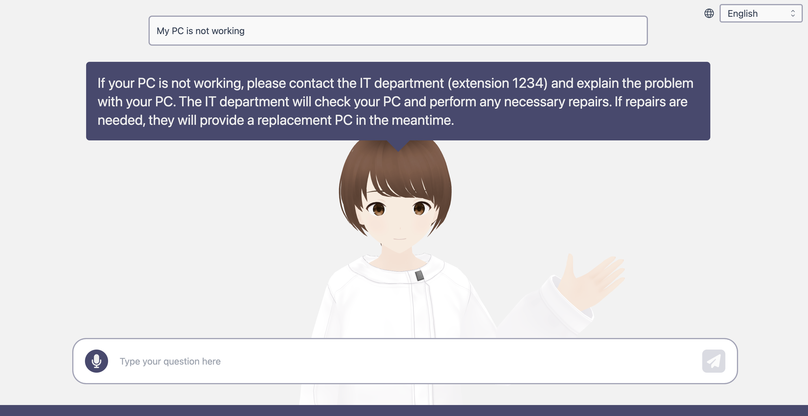
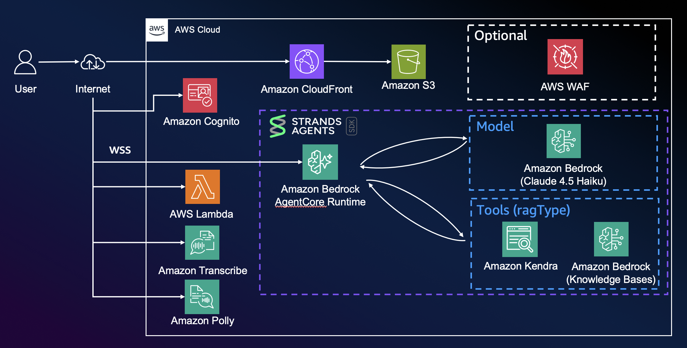

# Generative AI Avatar Chat

[README in Japanese](README.md)



This is a sample implementation of a Generative AI chatbot with a 3D avatar as the interface.

## Architecture



## Deployment

This application is deployed using the [AWS Cloud Development Kit](https://aws.amazon.com/jp/cdk/) (hereinafter referred to as CDK).

### Prerequisites

#### Setting up Credentials

To execute CDK, it is necessary to set up AWS credentials. Please follow the steps below.

* If deploying from a local PC
  * Please set up according to [these prerequisites](https://docs.aws.amazon.com/ja_jp/cdk/v2/guide/getting_started.html#getting_started_prerequisites).
* For other cases
  * It is recommended to deploy using [AWS Cloud9](https://aws.amazon.com/jp/cloud9/).
  * You can easily set up a Cloud9 environment using [this guide](https://github.com/aws-samples/cloud9-setup-for-prototyping).

#### Setting up the Base Model for Use with Amazon Bedrock

> [!IMPORTANT]
> Prior application is necessary to use the Anthropic Claude model in this repository. Open the [Model access screen (ap-northeast-1)](https://ap-northeast-1.console.aws.amazon.com/bedrock/home?region=ap-northeast-1#/modelaccess), check Anthropic Claude Haiku and Save changes. Please note that application is required for each region and model you wish to use.

By default, the `Claude Haiku 4.5` model via Japan Cross Region Inference in the Tokyo region (`ap-northeast-1`) is set for use. If you wish to change the region and model used, please modify `bedrockRegion` and `bedrockModelId` in `packages/cdk/lib/parameters.ts`. Model IDs can be found [here](https://docs.aws.amazon.com/bedrock/latest/userguide/model-ids.html).

**This application uses the [Strands Agents SDK](https://github.com/aws-samples/strands-agents) and is compatible with any model supported by the Bedrock Converse API.**

#### RAG Type Configuration

This application supports the following options for RAG (Retrieval-Augmented Generation) implementation:

* **Knowledge Base**: Uses Amazon Bedrock Knowledge Base
* **Kendra**: Uses Amazon Kendra
* **Both**: Use both RAG sources simultaneously (Agent selects appropriately)
* **None**: Answer with general knowledge without RAG

By default, only `Knowledge Base` is enabled. If you want to change the configuration, please modify `defaultParameters` or `envOverrides` in `packages/cdk/lib/parameters.ts`.

```typescript
// packages/cdk/lib/parameters.ts
const defaultParameters: AppParameters = {
  bedrockRegion: 'ap-northeast-1',
  bedrockModelId: 'jp.anthropic.claude-haiku-4-5-20251001-v1:0',
  rag: {
    kendra: { enabled: false },
    knowledgeBase: { enabled: true },
  },
  waf: {
    enabled: false,
  },
};

// Per-environment overrides (only specify differences from defaultParameters)
const envOverrides: Record<string, Partial<AppParameters>> = {
  base: {},   // backward compatible (stack name: RagAvatarStack)
  dev: {},
  stg: {},
  prod: {
    rag: {
      kendra: { enabled: true },
      knowledgeBase: { enabled: true },
    },
    waf: {
      enabled: true,
      allowedCountryCodes: ['JP'],
    },
  },
};
```

#### WAF (Web Application Firewall) Configuration

Set `waf.enabled` to `true` to automatically attach a WAF WebACL to CloudFront. The following options are available:

- `allowedIpV4AddressRanges`: List of allowed global IPv4 CIDRs
- `allowedIpV6AddressRanges`: List of allowed global IPv6 CIDRs
- `allowedCountryCodes`: List of allowed country codes (e.g. `['JP']`)

The WAF stack is automatically deployed to `us-east-1` as required for CloudFront.

#### Switching Environments

You can switch environments using the `ENV` environment variable. The stack name becomes `RagAvatarStack-{ENV}` (or `RagAvatarStack` when unset or `base`).

```bash
# base environment (default)
npm run cdk:deploy

# dev environment
ENV=dev npm run cdk:deploy

# prod environment
ENV=prod npm run cdk:deploy
```

> [!WARNING]
> **Notes when enabling both RAG sources**
> 
> If you set both to `true`, the Agent will search documents from both RAG sources, which may slow down response times. It is recommended to clearly distinguish the content of documents stored in each RAG source so that the Agent can select the appropriate tool.
> 
> **Recommended usage examples:**
> * **Knowledge Base**: Product manuals, technical specifications, etc.
> * **Kendra**: Internal FAQs, operational procedures, etc.
> 
> Please clarify the role of each RAG source and place documents appropriately.

### Deployment Steps

> [!IMPORTANT]
> **Docker ARM64 Build Requirement**
> 
> This application builds ARM64 Docker images during deployment. If you are running on an x86_64 machine, you need to set up Docker Buildx with QEMU for ARM64 emulation.
> 
> ```bash
> # Register QEMU
> docker run --rm --privileged tonistiigi/binfmt:latest --install arm64
> 
> # Create and start a Buildx builder
> docker buildx create --name arm-builder --platform linux/arm64 --use
> docker buildx inspect arm-builder --bootstrap
> ```

1. Please clone this repository.
1. Open the **root directory** of the cloned repository in your terminal. All following commands should be executed in the **root directory**.
1. Install the necessary packages with the following command.

    ```bash
    npm ci
    ```

1. If you have never used CDK before, a [Bootstrap](https://docs.aws.amazon.com/ja_jp/cdk/v2/guide/bootstrapping.html) process is required for the first time only. The following command is not necessary in an environment that has already been bootstrapped.

    ```bash
    npx -w packages/cdk cdk bootstrap
    ```

1. Deploy AWS resources using the command below. Please wait until the deployment is complete (it may take about 20 minutes).

    ```bash
    npm run cdk:deploy
    ```

1. Once the deployment is complete, the deployment information will be displayed as Outputs (`similar information is also outputted in packages/cdk/output.json`). `RagAvatarStack.FrontendCloudFrontURL` is the URL where it has been deployed. Please access this URL to use it.

    ```bash
    Outputs:
    RagAvatarStack.ApiIdPoolIdxxxxxxxx = us-west-2:xxxxxxxxxxxxxxxxxxxxxxxxxx
    RagAvatarStack.ApiQuestionStreamFunctionARNxxxxxxxx = arn:aws:lambda:us-west-2:123456789012:function:RagAvatarStack-ApiStreamQuestionxxxxxxxxxx-xxxxxxxxxxxx
    RagAvatarStack.FrontendCloudFrontURLxxxxxxxx = https://xxxxxxxxxxxxxxxxxxxxxxxxxx.cloudfront.net
    RagAvatarStack.S3DataSourceKendraIndexIdxxxxxxxx = xxxxxxxxxxxxxxxxxxxxxxxxxxxxxxxxxx
    RagAvatarStack.S3DataSourceKendraS3DataSourceIdxxxxxxxx = xxxxxxxxxxxxxxxxxxxxxxxxxxxxxxxxxx
    ```


### Redeployment Instructions

If you need to update the application, a redeployment is necessary. Execute the following command for an automatic differential deployment.

```bash
npm run cdk:deploy
```

### Document Reflection Procedure

The document reflection procedure varies depending on the selected RAG type.

#### Knowledge Base

When using Amazon Bedrock Knowledge Base, follow the steps below to reflect documents.

1. Access the [Bedrock Knowledge Base Console](https://ap-northeast-1.console.aws.amazon.com/bedrock/home?region=ap-northeast-1#/knowledge-bases) and open `rag-avatar-kb`.
2. Select `rag-avatar-kb-datasource` listed in the "Data sources" section.
3. Press the "Sync" button to reflect the documents.
4. If the sync history status shows "Completed", the documents are searchable.

#### Kendra

When using Amazon Kendra, it is necessary to perform a `Sync` with Kendra to reflect documents. Please follow the steps below to `Sync`.

1. Access the [Kendra Console](https://ap-northeast-1.console.aws.amazon.com/kendra/home?region=ap-northeast-1#indexes) and open `rag-avatar-index`.
2. Open the `Data sources` page and open `s3-data-source`.
3. Press the `Sync now` button to reflect the documents. If the `Last sync status` is displayed as `Successful`, the documents are searchable.

#### If you want to update documents

1. Store the documents.
   * **For Knowledge Base**: Store in `packages/cdk/docs/kb`
   * **For Kendra**: Store in `packages/cdk/docs/kendra`
2. Redeploy the application as per the `Redeployment Procedure` (the documents will be uploaded automatically).
3. **For Knowledge Base**: Perform a `Sync` as per the above document reflection procedure.
4. **For Kendra**: Perform a `Sync` as per the above document reflection procedure.

### Cleanup Procedure

1. Execute the following command. All deployed AWS resources will be deleted.

    ```bash
    npm run cdk:destroy
    ```

If an error occurs when executing the command above, please follow the steps below to manually delete the Stack.

1. Open [AWS CloudFormation](https://console.aws.amazon.com/cloudformation/home) and select `RagAvatarStack`.
1. Press Delete. You will be asked if you want to skip the deletion of the S3 Bucket that failed to delete, so check the box to execute the deletion.
1. The deletion of resources, excluding the skipped S3 Bucket, is completed.
1. Open [Amazon S3](https://s3.console.aws.amazon.com/s3/home) and search for the skipped S3 Bucket. (Please search using "RagAvatar" or similar.)
1. Perform Empty (to empty the Bucket) => Delete (to delete the Bucket).

### Running the Frontend Locally

The frontend can be run on a local PC by following the steps below. This allows you to immediately see the results of frontend modifications in your browser, significantly improving development efficiency.  
Please execute all of the following commands in the **root directory** of this repository.

Note that these steps assume that your local PC is set up for React development.

1. Copy `packages/web/.env` to create a `packages/web/.env.local` file.

    ```bash
    VITE_APP_REGION=Deployed region name
    VITE_APP_IDENTITY_POOL_ID=Value of RagAvatarStack.ApiIdPoolId from Outputs
    VITE_APP_QUESTION_STREAM_FUNCTION_ARN=Value of RagAvatarStack.ApiQuestionStreamFunctionARN from Outputs
    VITE_APP_PRESIGNED_URL_FUNCTION_ARN=Value of RagAvatarStack.PresignedUrlApiPresignedUrlFunctionARN from Outputs (only when using AgentCore Runtime)
    ```

    **How to check Outputs**
    * If you deployed from your PC
      * The `Outputs` values are output in `packages/cdk/output.json`, so please check there.
    * Otherwise
      * Open `RagAvatarStack` in the [CloudFormation Console](https://ap-northeast-1.console.aws.amazon.com/cloudformation/home).
      * Select the "Outputs" tab to see the values of `Outputs`.

1. If it's your first time, execute the following command to install packages.

    ```bash
    npm ci 
    ```

1. Execute the following command to start the local server for the frontend.

    ```bash
    npm run web:dev
    ```

## Contributors

[Yusuke Wada](https://github.com/wadabee)

[Tatsuya Shimada](https://github.com/tatshima)

[Shota Nakamoto](https://github.com/nsxshotaws)
